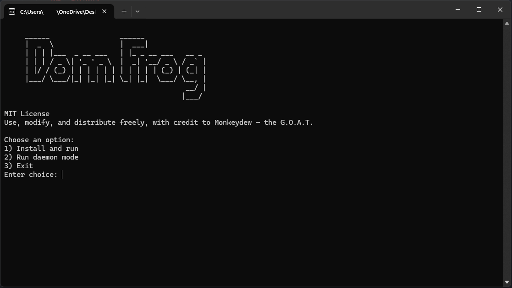

# DomFrog Backup Wizard

**MIT License**  
Use, modify, and distribute freely, with credit to Monkeydew — the G.O.A.T.

## Overview

DomFrog Backup Wizard makes **live backups** of all your saves and new turns for your games. It's designed to be working most of the time, kinda robust, and at minimum the backups should be reliable — using **default paths is recommended** for best results.

## Current Status

- **Installer:** In progress
- **Support for multiple nations per game:** In progress
- **Background process (daemon):** In progress
- **Save overwrites & recovery:** Planned
- **More robust tooling & GUI:** Planned
- **Cross-platform support:** Planned

Built-in Windows and Mac antivirus hate bootleg solutions so it'll take some time to implement the above.

## Support

My discord handle is @Monkeydew. I'll get around to messages and will likely have a support link in one of the more major dominions servers

## Warning ⚠️

This software was built and tested by an idiot.

## Compile

To compile
First make sure you have [golang installed](https://go.dev/) then  
you can use " go build -o DomFrog.exe . "
or if you are a golang nerd  
go build -trimpath -ldflags="-s -w" -o DomFrog.exe . ; upx --best --lzma DomFrog.exe

# Instructions

Launch the app before doing/downlaoding your turns and select 2. This will run in console while you play saving everything. Close when you close dom.

This app automatically copies your Dominions save folders and organizes them into clearly labeled backups.

When running, it takes each game folder from your **source folder** (e.g. `AppData\Roaming\Dominions6\savedgames`) and mirrors it into your chosen **destination folder**. Defaults:  
C:\Users\ <user> \OneDrive\Desktop\DomFrogBackup  
C:\Users\ <user> \Desktop\DomFrogBackup

Each game gets its own top-level folder in the destination, containing:

- Map and terrain files (`.map`, `.d6m`, `.tga`) stored at the top level.
- Subfolders for each turn, named like `Turn1_save0`, `Turn2_save0`, etc., which hold your `.trn` and `.2h` files.

### Folder Structure

- game_name
  - GameName.map
  - GameName.tga
  - ftherlnd
  - Turn1_save0
    - nation.trn
    - nation.2h
  - Turn1_save1
    - nation.trn
    - nation.2h
  - Turn2_save0
    - nation.trn
    - nation.2h

The core files sit in your **AppData** directory and do not need to be modified.  
To uninstall, simply delete the `DomFrog` folder inside AppData.
